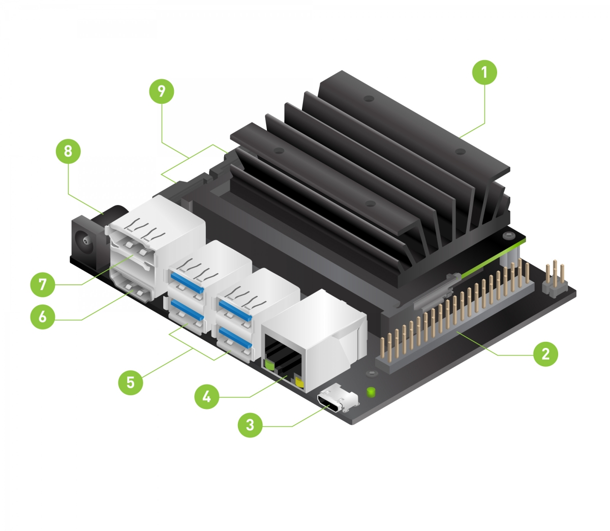
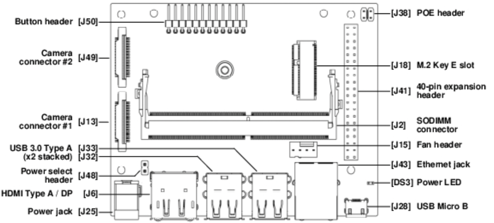
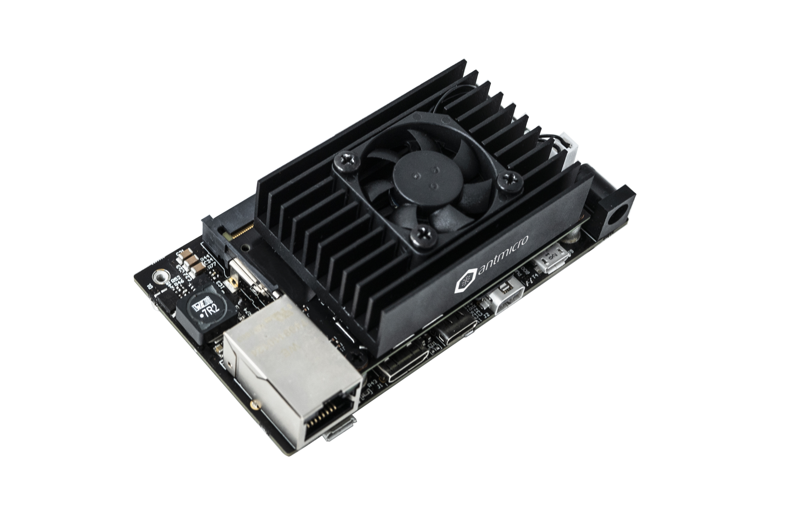
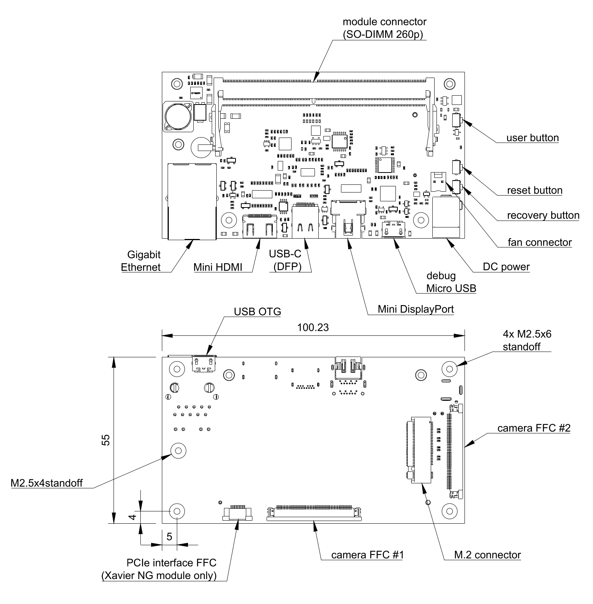
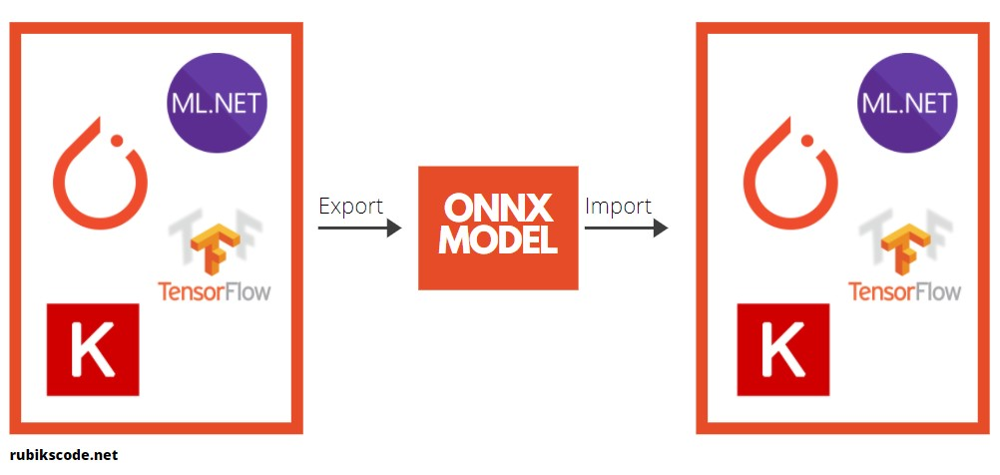
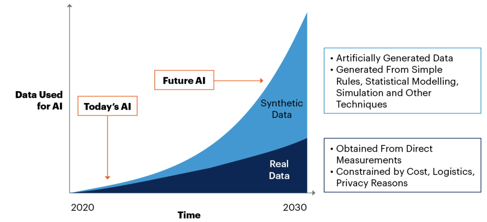

# Custom object detection in real-time

The main idea of this project is to present training methods based on [YoloV5](https://github.com/ultralytics/yolov5) neural network architecture. Project shows several ways to collect data, depicts entire training process based on gathered data (plastic Coca-Cola bottles) and run inference on [Jetson devices](https://www.nvidia.com/en-us/autonomous-machines/embedded-systems/). The training process was done on a desktop machine while the implementation of the retrained model was tested on Jetson Nano.

## Jetson Nano

Jetson Nano is an AI single-board computer for embedded developers. This small
size embedded system is designed for prototyping solutions in the field of
machine learning and artificial intelligence. Capabilities offered out of the box
include peripherals dedicated directly to RaspberryPi and Adafruit. Thanks to the
Nvidia jetpack SDK, every necessary software tool is already pre-installed on the
Linux system, based on Ubuntu 18.04 distribution. Therefore, it is possible to
benefit from software packages and tools such as CUDA, TensorRT, cuDNN. It is worth noting that the
cost of a small and relatively powerful device is around 99/59 Euro (4GB/2GB of RAM). There are also
more expensive versions like Jetson TX1, Jetson TX2, Jetson Xavier NX,
Jetson AGX Xavier, Jetson Orin.
Official documentation with various code samples is available on the GitHub repository - [link](https://github.com/dusty-nv/jetson-inference).

Dustin Franklin is a member of Nvidia Jetson Developers and provides a full
repository on GitHub with dedicated software implementation on Jetson Nano.
Every specific problem regarding Jetson Nano can be reported in the issues
section. In this project, I decided not to apply any pre-trained and
optimized model from the tutorials but take a closer look at the YOLO (You Only Look Once) algorithm.

Although, [GitHub](https://github.com/dusty-nv/jetson-inference) is the best place to familiarize users with coding on Jetson
Nano. Image shown below presents a Jetson Nano device.

</br>
<p align="center">
  
</p>
<p align="center">
Figure 1. Jetson Nano module integrated on the board B01 
</p>
</br>

</br>
<p align="center">
  
</p>
<p align="center">
Figure 2. Board B01 designed by NVIDIA
</p>
</br>

1. microSD card slot for main storage
2. 40-pin expansion header
3. Micro-USB port for 5V power input or for data
4. Gigabit Ethernet port
5. USB 3.0 ports (x4)
6. HDMI output port
7. DisplayPort connector
8. DC Barrel jack for 5V power input
9. MIPI CSI camera connectors
10. Antmicro project: [GitHub Link](https://github.com/antmicro/jetson-nano-baseboard)

<p align="center">
  
</p>
<p align="center">
Figure 3. Jetson Nano module integrated on the Antmicro's baseboard 
</p>

<p align="center">
  
</p>
<p align="center">
Figure 4. Baseboard designed by Antmicro 
</p>

## Image dataset

Collection of 250 coca-cola
images includes different position variants and backgrounds. The images are
divided into three folders: test 5%, train 70% and valid 25%. Each of them
includes subfolders with images and labels. Images have been resized to 416x416
pixels. The majority part of pictures contains
only standing positions and fully filled coca-cola bottles.

## Tips & Tricks for data labelling - Object Detection

1. Create categories and specific label names (Category example "Plastic bottles", label names "Coca-Cola", "Pepsi" ...)
2. Create tight bounding boxes
3. Annotate all objects of interest
4. Annotate occluded objects
5. Annotate the entirety of an object
6. Create clear annotation instructions
7. Use good annotation tools

The annotations for these tasks are in the form of bounding boxes and class names where the extreme coordinates of the bounding boxes and the class ID are set as the ground truth. This detection comes in the form of bounding boxes where the network detects the bounding box coordinates of each object and its corresponding class labels. [Guide to Image Annotation](https://www.v7labs.com/blog/image-annotation-guide)

## Directory structure

Default directory structure consists of two main files: detect.py and train.py. The
first one includes command options to parse arguments. It runs a chosen interface
with determined data, weights, configuration etc. The other one loads data, sets
hyperparameters, imports a yolo model and represents graph results either in
Tensorboard or using matplotlib. Directory __weights__ includes 
individual model __weights.pt__ typical for PyTorch Framework. Directory called models includes default .yaml configuration files. These files must be modified in order to be trained properly on a custom dataset. Number of classes should be converted into a sigle one. It stands for only one category
class of a Coca-Cola bottle. Besides this, several files need to be converted from a Pytorch model into Open Neural Network Exchange model [ONNX format](https://github.com/onnx/tutorials). 

</br>
<p align="center">
  
</p>
<p align="center">
Figure 11. How to convert PyTorch to TensorFlow model?
</p>
</br>

Directory __utils__ includes additional files with created and defined methods used in the
previously presented scripts. Eventually, all images are located in a __data__ directory . My decision was focused on simplifying this process of organising folders structure. For this purpose, I created a python script called create_data.py.
It automatically divides gathered images with labels into separate directories and converts resolution of the images.


## Dataset annotation

The standard annotation for YOLO models is .yaml file and Darknet weights format. This is actually a
configuration file which defines its architecture with parameters. All I had to do
in the files yolov5s.yaml and yolov5x.yaml was change the number of classes in
the second line of code. The essential file for the training is dataset.yaml which
should be located in a directory with images in order to avoid chaos in this
peculiar one with others. It includes paths for training and validation which should
be modified. Furthermore, the number of classes contained in the image folders
should be adjusted into 1. However, the name for a specific object should be
defined as Coca-Cola. Example of COCO format (JSON) and its convertion into YOLO format (Darknet .txt) can be found under this [link](https://github.com/ultralytics/JSON2YOLO)

## Image labelling

This is truly a time consuming part of the entire project. From the number of 250
images, only 13 of them were destined for testing purposes without creating
bounding boxes. For labelling images, I decided to use a web application
[LabelBox](https://labelbox.com/), I also recommand [Label Studio](https://labelstud.io/) - open source project made in Django framework. All resized images were uploaded by me, so that I could launch a label editor. There are several options to outline objects like polygon, bounding
box, polilyne, point, entity, segmentation. After all images have been created with
their bounding boxes, the next step is to download labelled files available either
in .json or .csv extension. It was necessary to convert them into a specific yolo .txt
file before training. Therefore I uploaded everything on [Roboflow](https://roboflow.ai/). This is a
smart web application that automatically interlocks images with labels. It offers
many functions such as dataset health check which can recognise incorrectly
labelled images or even image transformations like preprocessing and
augmentation.

</br>
<p align="center">
  
<p align=center> Figure 5. YOLOv5s batch_size: 16, epochs: 100, training time: 10 minutes</p>
</br>

## Training

In the case of YOLOv5, the training process is relatively easy to complete. After
data preparation, it is requisite to run training script train.py. I decided to take advantage of transfer learning using checkpoints. Both of them were pre-trained on a COCO dataset (default GPU common in a research field is NVIDIA Tesla P100). The smallest one, YOLOv5s weight consists
of 7.5 million parameters, on the other hand YOLOv5x consists of 89 million
parameters. My results stand on to train four different a neural network  times to gain better understanding of the
impact on the final training results. My first attempt at YOLOv5s was surprising.
With a batch size equal to 16 and a number of epochs equal to 100, the whole
training process on 237 images lasted only 10 minutes. In comparison, YOLOv5x
training with the batch size 8 (due to a problem with memory allocation) lasted
22 minutes. My second training session was set up to 3000 epochs. In this case,
training time was not proportionally equal. The bigger model was training for 10
hours and 30 minutes, while the smaller one only for 2 hours and 15 minutes.
Overall, on the desktop machine (GTX 1080), YOLOv5s achieved a stable 100 FPS which is
impressive and the other model YOLOv5x obtained a stable 30 FPS. The rapid
training process encouraged me to repeat the experiment on more epochs.
Therefore, both models have been set up to 3000 epochs with batch size equal to
32 and 6 due to limitation of the memory allocation.

## Evaluation

The Impressive part is that it takes only 10 minutes for a neural network to learn
and recognize the Coca-Cola pattern in the process of training. Images below present Generalized Intersection over Union and objectiveness for both training and validation data, detecting precision with recall, mean Average Precision.


In this scenario, I decided to discuss only GIoU and mAP. GIoU is one of the
most common evaluation metrics applied in object detection. In general, it defines
the area of taken into account shapes and is a good indicator of a loss function
[more details](https://giou.stanford.edu/GIoU.pdf). Epoch number of 100 seems insufficient to decrease it below value of 0.02.

</br>


<p align=center>    Figure 6. YOLOv5s batch size - 16, epochs - 100, training time - 10 minutes</p>
</br>


<p align=center>     Figure 7. YOLOv5x batch size - 8, epochs - 100, training time - 22 minutes</p>
</br>

Whereas, mAP - mean Average Precision measures the accuracy of the examined
object detector. This is correlated with precision and recall. Precision can be
defined as a correctly predicted percentage of images. 

Furthermore, recall only
measures positive cases from the prediction. Average Precision is an integral of
the area under precision-recall curve. In other words, it defines accuracy of the
trained model. As well figure 3. as figure 4. presents successfully trained models.
The difference is that the larger architecture of YOLO demands 5 times more
training time than the smaller one.

</br>


<p align=center> Figure 8. YOLOv5s batch size - 32, epochs - 3000, training time - 2.25 hours</p>
</br>


<p align=center>     Figure 9. YOLOv5x batch size - 6, epochs - 3000, training time - 10.5 hours </p>
</br>


## Implementation on Jetson Nano

To implement pre-trained models, it is necessary to copy the file with weights
called last.pt. This should be pasted in the project with weights directory on
Jetson Nano. In order to run and check out pre-trained object detector in live-time
on a web camera, type the following command:

```
python3 detect.py --source 0 --weights weights/yolov5s_cola.pt
```

Where yolov5s_cola.pt is our weight file that determines the structure of neuron
connections in a neural network. If there are no other peripherals connected to
Jetson Nano, parameter --source 0 defines a default device. Python script
detect.py invokes methods to run the inference on a web camera.

## Insights

Tests done on Jetson Nano demonstrated practical usage on this embedded
platform. Accuracy remains generally the same either on a desktop machine or
Jetson Nano device. The only significant difference is the speed performance.
Stable 100 fps using a small version of yolov5 and 30 fps of extra-large version
dropped down respectively to 15 fps on yolov5s and 1.6 fps on yolov5x. This
showcase makes an enormous difference by matching 472 GFLOPs on Jetson
Nano GPU to 8873 GFLOPs on Nvidia GTX 1080 graphics card.

Additionally, I noticed that by the increasing numbers of iterations during
training, the tendency of detecting is focused only on the entire object. In other
words, it is going to detect only fully filled 1.25l Coca-Cola plastic bottles with
high precision, because all images consisted of this object sort.

## Results

Yolov5s 100 epochs             |  Yolov5s 3000 epochs
:-------------------------:|:-------------------------:
  |  

</br>

Yolov5x 100 epochs             |  Yolov5x 3000 epochs
:-------------------------:|:-------------------------:
  |  


## Synthetic data generation

Synthetic Data is the data generated through computer programs such as Blender, game engines such as Unity or dedicated synthetic-data-generation engines such as NVIDIA Omniverse Replicator. 

</br>
<p align="center">
  
</p>
<p align="center">
Figure 10. Synthetic Data usage in the future
</p>
</br>

TODO LIST

Tool: [BlenderProc2](https://github.com/DLR-RM/BlenderProc)

- [ ] Create / Apply 3D Model of the Coca-Cola bottle
 - a) Create 3D Model using lidar & photogrammetry methods implemented in [Scaniverse iPhone 13 Pro](https://scaniverse.com/)
 - b) Create 3D Model using depth camera (IR laser projector + RGB Camera) implemented in [RealSense D435](https://www.intelrealsense.com/depth-camera-d435i/)
- [ ] Define custom scenes in Blender
- [ ] Render example scene with applied 3D model
- [ ] Create script for random data generation
- [ ] Create script to annotate images automatically
